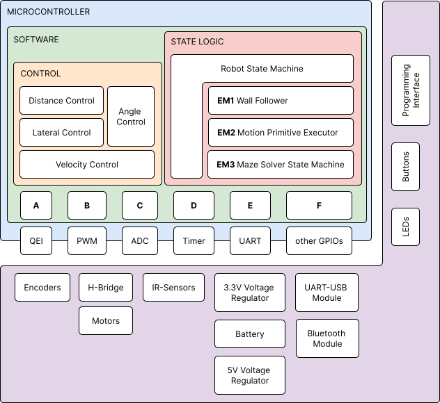

# Mazerunner Micromouse

## Folder Structure

<!-- Table with Links to the folders ? -->
<!-- - MyFirstProject.X contains the exercises from the class, and was modified for first tests
- mazerunner.X contains all working software for the final mouse.
- mms-algorithms contains the testing and simulating of the maze solving algorithms -->

| Folder            | Description                                       |
|-------------------|---------------------------------------------------|
| [MyFirstProject.X](./MyFirstProject.X) | Contains exercises from the class, modified for initial tests |
| [mazerunner.X](./mazerunner.X)       | Contains all working software for the final mouse |
| [mms-algorithms](./mms-algorithms)   | Contains testing and simulation of maze-solving algorithms |

## Software Structure Overview (mazerunner.X)

<!-- ### Where to Find elements from the Report:

#### State Logic
Robot State Machine: main.c

| Execution Mode | Description                                       | File Location         |
| -------------- | ------------------------------------------------- | ---------------------- |
| **EM1**        | (Simple) Wall Follower                           | *abstractControl.c*    |
| **EM2**        | (Simple) Motion Primitive Executor                | *abstractControl.c*    |
| **EM3**        | Maze Solver                                      | *mazeSolver.c*         |
| **EM4**        | Remote Controlled Motion Primitive Executor       | *abstractControl.c*    |

#### Control
Control Stack:
- Velocity Control: controllers.c
- Distance / Angle Control: controllers.c
- Lateral Control: controllers.c

Control Loop: 
- Timer2 ISR in myTimers.c

#### HAL Modules
HAL (Hardware Abstraction Layer) Functionality:
HAL A:
    - QEI: motorEncoders.c
HAL B:
    - PWM: myPWM.c
HAL C: 
    - ADC: adc.c
    - DMA: dma.c
    - Distance Sensors: distanceSensors.c
HAL D:
    - Timer: myTimers.c
HAL E:
    -  UART: serialComms.c
General Setup and HAL F: 
    - IOconfig.c
    - myButtons.c -->

### Where to Find Elements from the Report:

#### 🔴 State Logic

Robot State Machine: [main.c](./mazerunner.X/main.c)

| Execution Mode | Description                              | File Location                                |
| -------------- | ---------------------------------------- | --------------------------------------------- |
| **EM1**        | (Simple) Wall Follower                    | [abstractControl.c](./mazerunner.X/state_logic/abstractControl.c) |
| **EM2**        | (Simple) Motion Primitive Executor         | [abstractControl.c](./mazerunner.X/state_logic/abstractControl.c) |
| **EM3**        | Maze Solver                               | [mazeSolver.c](./mazerunner.X/state_logic/mazeSolver.c) |
| **EM4**        | Remote Controlled Motion Primitive Executor | [abstractControl.c](./mazerunner.X/state_logic/abstractControl.c) |

#### 🟡 Control

Control Stack:

| Control Type          | File Location                                  |
| --------------------- | ----------------------------------------------- |
| Velocity Control      | [controllers.c](./mazerunner.X/control/controllers.c) |
| Distance / Angle Control | [controllers.c](./mazerunner.X/control/controllers.c) |
| Lateral Control       | [controllers.c](./mazerunner.X/control/controllers.c) |

Control Loop: 

| Loop Component        | File Location                                      |
| ----------------------| --------------------------------------------------- |
| Timer2 ISR            | [myTimers.c](./mazerunner.X/hal/myTimers.c)            |

#### 🟢🔵 HAL Modules

HAL (Hardware Abstraction Layer) Functionality:

| HAL Module            | File Location                                   |
| ----------------------| ------------------------------------------------ |
| HAL A: QEI            | [motorEncoders.c](./mazerunner.X/hal/motorEncoders.c) |
| HAL B: PWM            | [myPWM.c](./mazerunner.X/hal/myPWM.c)               |
| HAL C: ADC, DMA, Distance Sensors | [adc.c](./mazerunner.X/hal/adc.c), [dma.c](./mazerunner.X/hal/dma.c), [distanceSensors.c](./mazerunner.X/hal/distanceSensors.c) |
| HAL D: Timer          | [myTimers.c](./mazerunner.X/hal/myTimers.c)         |
| HAL E: UART           | [serialComms.c](./mazerunner.X/hal/serialComms.c)    |
| General Setup, HAL F:| [IOconfig.c](./mazerunner.X/hal/IOconfig.c), [myButtons.c](./mazerunner.X/hal/myButtons.c) |

## mazerunner.X
can be downloaded and opened with the MPLAB X IDE and written to the micromouse. 